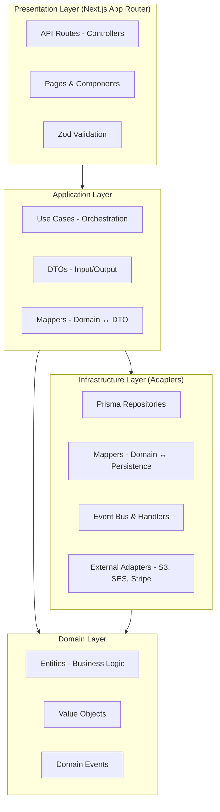

# Community OS - V1 MVP Project Plan

**Target Launch**: March 2026 (4 months from December 2025)
**Team Size**: 9 people
**Timeline**: 12-16 weeks
**Version**: V1 MVP - Core reliability + Forums + Basic Courses + Stripe only

---

## Project Overview

Community OS is an AI-first community platform that delivers Skool-level simplicity, Circle-style structure, and Heartbeat breadth without compromising on reliability, flexibility, or user experience.

### V1 MVP Goals

Ship a reliable, simple community platform focusing on:

- **Single-feed layout** with clean, intuitive navigation
- **Forums & Discussions** with rich text, media support, version history
- **Basic Course Builder** with text/video/PDF lessons and simple certificates
- **Dark mode** with system detection and neurodivergent-friendly UX
- **Stripe monetization** with content gating
- **Autosave & version history** to prevent content loss
- **Role-based permissions** (Owner, Admin, Moderator, Member, Guest)

### Deferred to V2 (July 2026)
- Real-time Chat with channels and DMs
- Calendar & Events with live sessions
- Multi-space organization layout
- PayPal + Razorpay payment gateways
- Gamification (points, badges, leaderboards)

### Deferred to V3 (December 2026)
- AI Moderation (spam/toxicity detection)
- @Assistant FAQ bot
- Thread summaries and engagement analytics

---

## Technology Stack

### Frontend
- **Framework**: Next.js 15.4.6 (App Router + Turbopack)
- **Language**: TypeScript 5 (strict mode)
- **UI Library**: React 19.1.0
- **Styling**: Tailwind CSS 4
- **Components**: shadcn/ui
- **State Management**: TanStack Query 5.85.0
- **Design System**: Complete color palettes (light/dark), typography scale, WCAG 2.1 AA compliant

### Backend
- **API**: Next.js API Routes (controllers)
- **Architecture**: Hexagonal/Clean Architecture
- **ORM**: Prisma 6.13.0
- **Database**: PostgreSQL (Railway)
- **Authentication**: Clerk.com with role-based access control

### Infrastructure
- **Hosting**: Railway (PostgreSQL + Next.js deployment)
- **File Storage**: AWS S3 (images 5x10MB, attachments up to 25MB)
- **Email**: AWS SES (notifications for mentions, replies)
- **Payments**: Stripe (test keys configured)
- **CI/CD**: Railway auto-deploy from main branch

### Development Tools
- **Testing**: Vitest (unit), Playwright (E2E), Testing Library (React)
- **Version Control**: Git + GitHub
- **Package Manager**: npm

---

## Architecture

### Hexagonal Architecture (Clean Architecture)

Community OS follows strict layer separation with dependency inversion:



**Dependency Flow**: `Presentation → Application → Domain ← Infrastructure (injected via ports)`

### Core Patterns

- **Domain-Driven Design**: Business logic in domain entities
- **Soft Delete**: All entities use `deletedAt` field with 7-day retention
- **Autosave**: 5-second intervals with visual "Draft saved ✓" indicator
- **Version History**: 10 versions per content item, 7-day retention
- **Event-Driven Side Effects**: Domain events published via event bus
- **Repository Pattern**: Database access through port/adapter pattern

---

## V1 MVP Phase Breakdown

### Phase 1: Foundation - Auth, User Roles, Dark Mode
**Duration**: 1-2 weeks
**Effort**: 60 hours

**Key Deliverables**:
- User entity with Clerk integration
- Community entity with role-based permissions (Owner, Admin, Moderator, Member, Guest)
- Sidebar + TopNav components (based on react-design.md)
- Dark mode toggle with system detection
- Design system colors and typography applied

**Technical Tasks**:
1. Domain: User + Community entities with role enums
2. Prisma: User + Community schema with soft delete
3. Infrastructure: Clerk.com webhook handlers for user sync
4. Application: CreateUser, UpdateUser, GetUserById use cases
5. Presentation: Sidebar, TopNav, DarkModeToggle components
6. Validation: Zod schemas for user input

**Success Criteria**:
- Users can sign up/login via Clerk
- Roles properly assigned and enforced
- Dark mode persists across sessions
- UI matches design_system.md specifications

---

### Phase 2: Forums - Posts, Comments, Rich Text
**Duration**: 2-3 weeks
**Effort**: 100 hours

**Key Deliverables**:
- Post creation with rich text editor (TipTap or similar)
- Comment system with 2-level threading
- File uploads (images 5x10MB, attachments up to 25MB via AWS S3)
- Filter Bar (All, New, Top - no Solved/Trending in V1)
- Post Card component with reactions (like/helpful)
- Autosave every 5 seconds

**Technical Tasks**:
1. Domain: Post + Comment entities with content versioning
2. Prisma: Post + Comment + PostAttachment schema
3. Infrastructure: AWS S3 repository for file uploads
4. Application: CreatePost, UpdatePost, CreateComment use cases with autosave logic
5. Presentation: PostComposer, PostCard, CommentThread, FilterBar components
6. Events: PostCreated, PostUpdated, CommentCreated domain events

**Success Criteria**:
- Rich text posts with formatting (bold, italic, lists, links)
- Image upload with 5x10MB limit enforced
- Attachment upload with 25MB limit enforced
- Comments display with 2-level threading
- Autosave indicator shows "Draft saved ✓"
- Filter Bar switches between All/New/Top views

---

### Phase 3: Version History & Undelete
**Duration**: 1 week
**Effort**: 40 hours

**Key Deliverables**:
- ContentVersion entity storing 10 versions per post/comment
- Version history UI showing past versions
- Undelete functionality for soft-deleted content
- 7-day retention window for versions and deleted content

**Technical Tasks**:
1. Domain: ContentVersion entity with content snapshots
2. Prisma: ContentVersion schema with foreign keys to Post/Comment
3. Application: SaveContentVersion, ListVersions, RestoreVersion use cases
4. Infrastructure: Scheduled job to purge versions >7 days old
5. Presentation: VersionHistoryModal, UndeleteButton components

**Success Criteria**:
- Every post/comment save creates version snapshot
- Version history shows up to 10 versions
- Users can restore previous versions
- Deleted content can be undeleted within 7 days
- Old versions auto-purge after 7 days

---

### Phase 4: Search, @Mentions, Notifications
**Duration**: 1-2 weeks
**Effort**: 60 hours

**Key Deliverables**:
- PostgreSQL full-text search for posts and member names
- @mention support in rich text editor
- Email notifications via AWS SES (mentions, replies)
- Notification Bell UI with unread count

**Technical Tasks**:
1. Prisma: Add full-text search indexes to Post table
2. Application: SearchPosts, SearchMembers use cases with ranking
3. Infrastructure: AWS SES email repository
4. Domain: Notification entity with read/unread status
5. Presentation: SearchBar, MentionAutocomplete, NotificationBell components
6. Events: MentionCreated, ReplyCreated → trigger email notifications

**Success Criteria**:
- Search returns relevant posts and members in <500ms
- @mentions trigger autocomplete dropdown
- Email sent when user is @mentioned
- Email sent when post receives reply
- Notification bell shows unread count
- Clicking notification marks as read

---

### Phase 5: Basic Courses
**Duration**: 2 weeks
**Effort**: 80 hours

**Key Deliverables**:
- Course structure with sections and lessons
- Lesson types: Text, Video embed (YouTube/Vimeo), PDF upload
- Progress tracking (lesson completion %)
- Simple certificates (auto-generated, no customization)
- Drip content based on start date
- Lesson comments (no video timestamps in V1)

**Technical Tasks**:
1. Domain: Course, Section, Lesson, LessonProgress entities
2. Prisma: Course + Section + Lesson + LessonProgress schema
3. Infrastructure: PDF storage in AWS S3
4. Application: CreateCourse, EnrollUser, MarkLessonComplete use cases
5. Presentation: CourseBuilder, LessonViewer, CertificateGenerator components
6. Business Logic: Drip content calculation based on course.startDate

**Success Criteria**:
- Course creator can build multi-section courses
- Lessons support text, video embed, PDF upload
- Members can enroll and track progress
- Progress bar shows % completion
- Certificates auto-generate on 100% completion
- Drip content releases lessons based on schedule
- Lesson comments work without video timestamps

---

### Phase 6: Monetization - Stripe + Content Gating
**Duration**: 2 weeks
**Effort**: 70 hours

**Key Deliverables**:
- PaymentTier entity (Free + 1 Paid tier only)
- Stripe Checkout integration for subscriptions
- Stripe webhook handler for payment events
- Content gating (forums, courses) by tier
- Admin analytics dashboard (MRR, trial-to-paid conversion)

**Technical Tasks**:
1. Domain: PaymentTier, Subscription entities
2. Prisma: PaymentTier + Subscription + Payment schema
3. Infrastructure: Stripe repository for checkout/webhooks
4. Application: CreateCheckoutSession, HandleWebhook, CheckAccess use cases
5. Presentation: PricingPage, CheckoutFlow, AdminAnalytics components
6. Security: Webhook signature verification, role-based access control

**Success Criteria**:
- Community owner can define Free + 1 Paid tier
- Members can subscribe via Stripe Checkout
- Webhooks update subscription status (active, canceled, past_due)
- Gated content only accessible to paid members
- Admin sees MRR, trial-to-paid %, churn rate
- Stripe test mode configured with test keys

---

## Versioned Roadmap

### V1 MVP - March 2026 (4 months)
**Focus**: Core reliability, Forums, Basic Courses, Stripe monetization

**Features**:
- Single-feed layout
- Forums (posts, comments, rich text, version history)
- Basic Courses (text/video/PDF, simple certificates)
- Search (@mentions, notifications)
- Dark mode
- Stripe subscription + content gating
- Autosave (5s) + version history (10 versions, 7 days)

**Team**: 9 people
**Timeline**: 12-16 weeks
**Success Metrics**:
- 50% Day 1 Activation Rate
- 25% Weekly Active Members
- 99.5% Uptime
- 15% Trial-to-Paid Conversion
- 0 Draft Loss Incidents

---

### V2 - Engagement & Structure (July 2026, +4 months)
**Focus**: Real-time Chat, Calendar, Multi-space, Gamification

**New Features**:
- Real-time Chat (channels, DMs, typing indicators)
- Calendar & Events (RSVP, live sessions with Mux/Cloudflare)
- Multi-space layout organization
- PayPal + Razorpay payment gateways
- Gamification (points, badges, leaderboards, levels)
- Course quizzes with auto-grading
- Course assignments with manual grading
- Custom certificates with branding

**Team**: 9-12 people
**Timeline**: 4 months (months 5-8)

---

### V3 - AI-Powered Community (December 2026, +5 months)
**Focus**: AI Moderation, @Assistant bot, Engagement Analytics

**New Features**:
- AI Moderation (spam/toxicity auto-flagging)
- @Assistant FAQ bot (trained on community content)
- Thread summaries (auto-generated)
- Engagement analytics (trending topics, member insights)
- Advanced email marketing (drip campaigns, segmentation)
- Voice messages in chat
- Breakout rooms in live sessions

**Team**: 12-14 people
**Timeline**: 5 months (months 9-13)

---

### V4 - Enterprise & Scale (Future)
**Focus**: White-label, SSO, Advanced integrations

**Features**:
- White-label mobile apps (iOS + Android)
- Enterprise SSO (SAML)
- SOC 2 compliance
- Advanced API webhooks
- Custom integrations (Zapier, Make)

---

### V5 - Global & Advanced (Future)
**Focus**: Multi-language, advanced AI, marketplace

**Features**:
- Multi-language support (i18n)
- AI-powered translations
- Marketplace for community templates
- Advanced analytics and reporting

---

## Testing Strategy

### Unit Testing (Vitest)
**Scope**: Domain layer (pure business logic)

**Focus Areas**:
- Entity validation logic
- Value object correctness
- Domain event creation
- Business rule enforcement

**Target Coverage**: ≥80% for domain layer

**Example**: Test that Post entity enforces max 5 images

---

### Integration Testing (Vitest + Test DB)
**Scope**: Repository layer (Prisma with real PostgreSQL)

**Focus Areas**:
- Database queries (create, read, update, delete)
- Soft delete filtering (`deletedAt: null`)
- Full-text search accuracy
- Transaction rollbacks

**Target Coverage**: ≥70% for infrastructure layer

**Example**: Test that PostRepository correctly filters deleted posts

---

### End-to-End Testing (Playwright)
**Scope**: Full user workflows across UI + API + Database

**Focus Areas**:
- User signup/login flow (Clerk integration)
- Post creation with autosave (5s intervals)
- Comment threading (2 levels)
- File uploads (S3 integration)
- Payment flow (Stripe Checkout)
- Version history restore

**Target Coverage**: All critical user paths

**Example**: Test complete post creation → autosave → publish → version restore workflow

---

### Accessibility Testing
**Scope**: WCAG 2.1 AA compliance

**Focus Areas**:
- Keyboard navigation
- Screen reader compatibility
- Color contrast ratios (4.5:1 minimum)
- Focus indicators
- ARIA labels

**Tools**: axe DevTools, Lighthouse

---

## Deployment Plan

### Railway Configuration

**PostgreSQL Database**:
- Plan: Starter ($5/month during development)
- Region: US West (or closest to team)
- Automatic backups enabled
- Connection pooling configured

**Next.js Application**:
- Plan: Hobby ($5/month during development)
- Auto-deploy from `main` branch
- Environment variables configured:
  - `DATABASE_URL` (Railway PostgreSQL)
  - `CLERK_SECRET_KEY`, `NEXT_PUBLIC_CLERK_PUBLISHABLE_KEY`
  - `STRIPE_SECRET_KEY`, `STRIPE_WEBHOOK_SECRET`
  - `AWS_ACCESS_KEY_ID`, `AWS_SECRET_ACCESS_KEY`, `AWS_S3_BUCKET_NAME`
  - `AWS_SES_REGION`, `SES_FROM_EMAIL`

**Custom Domain**:
- Deferred to V2 (not required for V1 MVP)

---

### CI/CD Pipeline

**Automated Deployment**:
1. Push to `main` branch triggers Railway build
2. Railway runs `npm run build`
3. Prisma migrations applied automatically
4. Health check endpoint `/api/health` verified
5. Deployment goes live if checks pass

**Pre-Deploy Checks**:
- TypeScript compilation (`tsc --noEmit`)
- ESLint validation (`npm run lint`)
- Unit tests (`npm run test`)
- Prisma schema validation (`npx prisma validate`)

**Rollback Strategy**:
- Railway keeps previous deployments for instant rollback
- Database migrations use reversible migrations where possible
- Feature flags for gradual rollout (deferred to V2)

---

### Environment Variables

**Required for V1 MVP**:

```env
# Database (Railway)
DATABASE_URL="postgresql://..."

# Authentication (Clerk.com)
CLERK_SECRET_KEY="sk_..."
NEXT_PUBLIC_CLERK_PUBLISHABLE_KEY="pk_..."
CLERK_WEBHOOK_SECRET="whsec_..."

# Payments (Stripe)
STRIPE_SECRET_KEY="sk_test_..."
STRIPE_PUBLISHABLE_KEY="pk_test_..."
STRIPE_WEBHOOK_SECRET="whsec_..."

# File Storage (AWS S3)
AWS_ACCESS_KEY_ID="AKIA..."
AWS_SECRET_ACCESS_KEY="..."
AWS_S3_BUCKET_NAME="community-os-uploads"
AWS_REGION="us-west-2"

# Email (AWS SES)
AWS_SES_REGION="us-west-2"
SES_FROM_EMAIL="noreply@communityos.com"

# Application
NEXT_PUBLIC_APP_URL="https://app.communityos.com"
NODE_ENV="production"
```

**Security Notes**:
- Never commit `.env` files to Git
- Use Railway's environment variable UI for production secrets
- Rotate keys quarterly
- Test webhooks use Railway test endpoints

---

## Success Metrics

### V1 MVP Targets (March 2026)

**Activation**:
- 50% Day 1 Activation Rate (user creates first post or enrolls in course)
- 25% Weekly Active Members (returning users per week)

**Reliability**:
- 99.5% Uptime (max 3.6 hours downtime per month)
- 0 Draft Loss Incidents (autosave + version history prevent content loss)

**Performance**:
- <500ms p95 for search queries
- <3s initial page load on 3G networks
- <200ms API response time (p95)

**Monetization**:
- 15% Trial-to-Paid Conversion (free members upgrading to paid tier)
- <5% Monthly Churn Rate

**Quality**:
- 0 critical security vulnerabilities
- ≥80% unit test coverage for domain layer
- ≥70% integration test coverage for repositories
- WCAG 2.1 AA compliance (100% of core features)

---

## Risk Management

### Technical Risks

**Risk**: Autosave conflicts when multiple users edit same post
- **Mitigation**: Implement optimistic locking with version number
- **Fallback**: Show conflict resolution UI if versions diverge

**Risk**: S3 upload failures lose user content
- **Mitigation**: Store base64 content in browser localStorage as backup
- **Fallback**: Retry upload on next autosave cycle

**Risk**: Stripe webhook delivery failures cause subscription status desync
- **Mitigation**: Implement idempotent webhook handlers with retry logic
- **Fallback**: Manual admin dashboard for subscription status correction

---

### Timeline Risks

**Risk**: Team velocity slower than estimated (12-16 weeks)
- **Mitigation**: Review phases.json estimates with team leads
- **Fallback**: Defer Phase 5 (Courses) to V2 if needed

**Risk**: Third-party service downtime (Clerk, Stripe, Railway)
- **Mitigation**: Monitor status pages, implement circuit breakers
- **Fallback**: Graceful degradation (e.g., disable signup during Clerk outage)

---

### Scope Risks

**Risk**: Feature creep from V2/V3 features during V1 development
- **Mitigation**: Strict adherence to V1-MVP.md scope document
- **Fallback**: Defer all non-V1 features to backlog with clear version tagging

---

## Team Structure (9 people)

**Recommended Roles**:
- 1x Tech Lead / Architect (oversees hexagonal architecture compliance)
- 2x Backend Engineers (Prisma repositories, use cases, domain logic)
- 2x Frontend Engineers (React components, UI implementation)
- 1x Full-Stack Engineer (API routes, integration work)
- 1x QA Engineer (E2E tests, accessibility testing)
- 1x DevOps Engineer (Railway deployment, monitoring)
- 1x Product Manager / Scrum Master (phases.json tracking, blockers)

**Communication**:
- Daily standups (15 min async or sync)
- Weekly sprint reviews (align with phases.json milestones)
- Architecture Decision Records (ADRs) for major technical decisions

---

## Next Steps

1. **Review this PROJECT_PLAN.md** with team leads for timeline validation
2. **Design Prisma schema** for V1 MVP entities (Phase 1-6 requirements)
3. **Set up Railway environments** (development, staging, production)
4. **Initialize repository** with requirements documentation commit
5. **Kick off Phase 1** (Foundation) with User + Community entities

---

**Last Updated**: December 2025
**Version**: 1.0
**Status**: Ready for Team Review
