# Dashboard Architecture

Hexagonal (Clean) Architecture implementation for the Sixty Community admin dashboard with strict layer separation and dependency inversion.

## Architecture Overview

The dashboard follows Hexagonal Architecture (Ports and Adapters) with four distinct layers:

```mermaid
graph TD
    subgraph Presentation["🎨 Presentation Layer (src/app/api + src/components/dashboard)"]
        API[Next.js API Routes]
        Components[React Components]
        Pages[Dashboard Pages]
    end

    subgraph Application["📋 Application Layer (src/application)"]
        UseCase[Use Cases]
        DTO[DTOs]
        Ports[Repository Interfaces]
        Mappers[DTO Mappers]
    end

    subgraph Domain["💎 Domain Layer (src/domain)"]
        Entity[Domain Entities]
        Events[Domain Events]
        ValueObjects[Value Objects]
    end

    subgraph Infrastructure["🔧 Infrastructure Layer (src/infrastructure)"]
        Repo[Prisma Repositories]
        PrismaMappers[Prisma Mappers]
        Prisma[(Prisma Client)]
    end

    API --> UseCase
    Components --> API
    Pages --> Components
    UseCase --> Entity
    UseCase --> Ports
    Repo -.implements.-> Ports
    Repo --> Prisma
    Repo --> PrismaMappers
    PrismaMappers --> Entity
    Mappers --> DTO
    UseCase --> Mappers
```



## Layer Responsibilities

### 1. Domain Layer (`src/domain/`)
**Pure business logic with zero dependencies**

- **Entities**: Business objects with behavior (Community, Member, Post)
- **Value Objects**: Immutable objects (MetricValue, TimeRange)
- **Domain Events**: State change notifications (MemberJoinedEvent)

**Rules**:
- ✅ No framework imports
- ✅ Private fields with getters only
- ✅ Input validation in methods
- ❌ No database access
- ❌ No HTTP concerns

### 2. Application Layer (`src/application/`)
**Orchestrates business logic and defines application operations**

**Use Cases** (`use-cases/dashboard/`):
- `GetDashboardMetricsUseCase`: Aggregates metrics from domain entities
- `GetRecentActivityUseCase`: Fetches recent activity with type classification
- `GetMembersUseCase`: Paginated member list with filters
- `GetContentPostsUseCase`: Paginated content list with filters

**DTOs** (`dto/dashboard.dto.ts`):
- `DashboardMetricsDTO`: Complete metrics object
- `ActivityItemDTO`: Activity feed item
- `MemberDTO`: Member profile
- `ContentPostDTO`: Post metadata

**Ports** (`ports/dashboard-repository.interface.ts`):
```typescript
export interface IDashboardRepository {
  getMetrics(communityId: string, timeFilter: TimeFilter): Promise<DashboardMetricsDTO>;
  getRecentActivity(communityId: string, limit: number): Promise<ActivityItemDTO[]>;
  getMembers(params: GetMembersInput): Promise<{ members: MemberDTO[], pagination: PaginationDTO }>;
  getContentPosts(params: GetContentPostsInput): Promise<{ posts: ContentPostDTO[], pagination: PaginationDTO }>;
}
```

**Mappers** (`mappers/dashboard-metrics-dto.mapper.ts`):
- Convert Domain entities → DTOs
- Format values for presentation
- Calculate derived fields

**Rules**:
- ✅ Depends on Domain layer only
- ✅ Returns DTOs, never Domain entities
- ✅ Uses repository interfaces (ports)
- ❌ No Prisma client access
- ❌ No HTTP concerns

### 3. Infrastructure Layer (`src/infrastructure/`)
**Implements technical concerns and adapters**

**Repositories** (`repositories/dashboard.repository.prisma.ts`):
```typescript
export class DashboardRepositoryPrisma implements IDashboardRepository {
  async getMetrics(communityId: string, timeFilter: TimeFilter): Promise<DashboardMetricsDTO> {
    // 1. Calculate time ranges
    const { currentStart, currentEnd, previousStart, previousEnd } = this.calculateTimeRanges(timeFilter);

    // 2. Fetch current period data
    const currentMetrics = await this.fetchMetricsData(communityId, currentStart, currentEnd);

    // 3. Fetch previous period data
    const previousMetrics = await this.fetchMetricsData(communityId, previousStart, previousEnd);

    // 4. Calculate percentage changes
    const membersChange = this.calculatePercentageChange(currentMetrics.members, previousMetrics.members);

    // 5. Map to DTO with formatting
    return DashboardMetricsDtoMapper.toDto({
      members: { value: currentMetrics.members, change: membersChange },
      posts: { value: currentMetrics.posts, change: postsChange },
      // ...
    });
  }
}
```

**Rules**:
- ✅ Implements Application layer interfaces (ports)
- ✅ Uses Prisma client for database access
- ✅ Filters `deletedAt: null` for soft delete
- ❌ No business logic
- ❌ No HTTP concerns

### 4. Presentation Layer (`src/app/api/` + `src/components/dashboard/`)

**API Routes** (`src/app/api/dashboard/`):
```typescript
// app/api/dashboard/metrics/route.ts
export async function GET(request: NextRequest) {
  try {
    // 1. Authenticate
    const { userId } = await auth();
    if (!userId) {
      return NextResponse.json({ success: false, message: 'Unauthorized' }, { status: 401 });
    }

    // 2. Validate input
    const searchParams = request.nextUrl.searchParams;
    const validatedParams = QuerySchema.parse({
      communityId: searchParams.get('communityId'),
      timeFilter: searchParams.get('timeFilter') || '30d',
    });

    // 3. Invoke Use Case
    const useCase = new GetDashboardMetricsUseCase(new DashboardRepositoryPrisma());
    const metrics = await useCase.execute(validatedParams);

    // 4. Return DTO
    return NextResponse.json({ success: true, data: metrics }, {
      status: 200,
      headers: { 'Cache-Control': 'public, s-maxage=30, stale-while-revalidate=60' },
    });
  } catch (error) {
    // 5. Map errors to HTTP codes
    if (error instanceof z.ZodError) {
      return NextResponse.json({ success: false, message: 'Validation error', errors: error.issues }, { status: 400 });
    }
    // ...
  }
}
```

**React Components** (`src/components/dashboard/`):
```typescript
// components/dashboard/home/MetricsGrid.tsx
'use client';

export function MetricsGrid() {
  // 1. Fetch data with TanStack Query
  const { data, isLoading, error } = useQuery({
    queryKey: ['dashboard', 'metrics', communityId, timeFilter],
    queryFn: async () => {
      const response = await fetch(`/api/dashboard/metrics?communityId=${communityId}&timeFilter=${timeFilter}`);
      if (!response.ok) throw new Error('Failed to fetch metrics');
      return response.json();
    },
  });

  // 2. Handle loading/error states
  if (isLoading) return <MetricCardSkeleton />;
  if (error) return <ErrorMessage />;

  // 3. Render with DTOs
  return (
    <div className="grid grid-cols-1 md:grid-cols-2 xl:grid-cols-4 gap-6">
      <MetricCard {...data.members} icon={<Users />} />
      <MetricCard {...data.posts} icon={<FileText />} />
      <MetricCard {...data.comments} icon={<MessageCircle />} />
      <MetricCard {...data.monthlyRecurringRevenue} icon={<DollarSign />} />
    </div>
  );
}
```

**Rules**:
- ✅ Validate input with Zod
- ✅ Invoke Use Cases with clean input
- ✅ Map errors to HTTP status codes
- ✅ Return DTOs in responses
- ❌ No business logic
- ❌ No Prisma access

## Data Flow

### Request Flow (GET /api/dashboard/metrics)

```
1. Client Request
   ↓
2. API Route (Presentation)
   - Authenticate user
   - Validate query parameters
   ↓
3. Use Case (Application)
   - Validate business rules
   - Coordinate domain operations
   ↓
4. Repository Interface (Application)
   - Define data contract
   ↓
5. Repository Implementation (Infrastructure)
   - Query Prisma database
   - Map Prisma models → Domain entities
   ↓
6. DTO Mapper (Application)
   - Convert Domain entities → DTOs
   - Format for presentation
   ↓
7. API Route (Presentation)
   - Return DTO as JSON
   ↓
8. Client Receives DTO
```

### Dependency Rule

**Critical**: Dependencies must flow inward only!

```
Presentation → Application → Domain
Infrastructure → Application → Domain
```

**Violations (DO NOT DO)**:
- ❌ Domain importing from Application, Infrastructure, or Presentation
- ❌ Application importing from Infrastructure or Presentation
- ❌ Infrastructure importing from Presentation

## Component Architecture

### Page Structure
```
app/(dashboard)/
├── layout.tsx              # Dashboard layout wrapper
├── page.tsx                # Home tab (metrics, activity, tasks)
├── members/
│   └── page.tsx            # Members management
├── content/
│   └── page.tsx            # Content moderation
└── analytics/
    └── page.tsx            # Analytics dashboards
```

### Component Hierarchy
```
DashboardLayout
├── DashboardSidebar (planned)
│   ├── CommunitySwitcher
│   ├── NavSection
│   │   └── NavItem
│   └── SidebarFooter
├── TopBar (planned)
│   └── TopBarActions
└── MainContent
    ├── WelcomeBanner
    ├── MetricsGrid
    │   └── MetricCard
    ├── ActivityGraph
    ├── RecentActivity
    │   └── ActivityFeed
    ├── PendingTasks
    ├── QuickActions
    └── RecommendedResources
```

## State Management

### Server State (TanStack Query)
```typescript
// React Query for API data
const { data, isLoading, error } = useQuery({
  queryKey: ['dashboard', 'metrics', communityId, timeFilter],
  queryFn: fetchMetrics,
  staleTime: 30000, // 30 seconds
  refetchInterval: 60000, // 1 minute
});
```

### Client State (React Hooks)
```typescript
// Local component state
const [timeFilter, setTimeFilter] = useState<TimeFilter>('30d');
const [isOpen, setIsOpen] = useState(false);
```

### Navigation State (Zustand - Planned)
```typescript
// Global navigation state
interface NavigationState {
  sidebarOpen: boolean;
  activePath: string;
  toggleSidebar: () => void;
  setSidebarOpen: (open: boolean) => void;
  setActivePath: (path: string) => void;
}

const useNavigationStore = create<NavigationState>((set) => ({
  sidebarOpen: true,
  activePath: '/',
  toggleSidebar: () => set((state) => ({ sidebarOpen: !state.sidebarOpen })),
  setSidebarOpen: (open) => set({ sidebarOpen: open }),
  setActivePath: (path) => set({ activePath: path }),
}));
```

## Performance Optimizations

### API Layer
- **ISR Caching**: 30s revalidation with 60s stale-while-revalidate
- **Query Optimization**: Prisma select specific fields only
- **Pagination**: Server-side with efficient skip/take
- **Parallel Queries**: Use Promise.all for independent data

### Component Layer
- **Code Splitting**: Dynamic imports for Chart.js
- **Skeleton Loading**: Instant loading states
- **Memoization**: React.memo for expensive components (future)
- **Virtualization**: For long lists (future)

### Database Layer
- **Indexes**: On frequently queried fields (communityId, createdAt, deletedAt)
- **Aggregations**: Pre-calculate metrics where possible
- **Connection Pooling**: Prisma connection pool

## Testing Strategy

### Domain Layer
**Pure unit tests** (no mocks needed):
```typescript
describe('MetricValue', () => {
  it('calculates percentage change correctly', () => {
    const metric = new MetricValue(120, 100);
    expect(metric.getPercentageChange()).toBe(20);
  });
});
```

### Application Layer
**Unit tests with fake repositories**:
```typescript
describe('GetDashboardMetricsUseCase', () => {
  it('returns metrics DTO', async () => {
    const fakeRepository = new FakeDashboardRepository();
    const useCase = new GetDashboardMetricsUseCase(fakeRepository);

    const result = await useCase.execute({ communityId: '123', timeFilter: '30d' });

    expect(result).toMatchObject({
      members: expect.any(Object),
      posts: expect.any(Object),
    });
  });
});
```

### Infrastructure Layer
**Integration tests with test database**:
```typescript
describe('DashboardRepositoryPrisma', () => {
  it('fetches metrics from database', async () => {
    const repository = new DashboardRepositoryPrisma();

    const metrics = await repository.getMetrics('test-community', '7d');

    expect(metrics.members.value).toBeGreaterThanOrEqual(0);
  });
});
```

### Presentation Layer
**E2E tests with Playwright**:
```typescript
test('dashboard displays metrics', async ({ page }) => {
  await page.goto('/dashboard');

  await expect(page.getByText('Total Members')).toBeVisible();
  await expect(page.getByText(/\d{1,3}(,\d{3})*/)).toBeVisible();
});
```

## Security Considerations

### Authentication
- All API routes require Clerk authentication
- Server-side validation with `auth()` from `@clerk/nextjs/server`
- No client-side authentication bypass

### Authorization
- Community ownership verification (future)
- Role-based access control (future)
- Permission checks before sensitive operations

### Data Protection
- Soft delete (deletedAt filter on all queries)
- No sensitive data in DTOs
- API rate limiting (future)

### Input Validation
- Zod schemas at API boundary
- Type-safe DTOs throughout
- SQL injection prevention via Prisma

## Monitoring & Observability

### Logging
```typescript
// Error logging
console.error('[API] Unexpected error:', error);

// Performance logging (future)
console.log('[API] Metrics fetch took:', endTime - startTime, 'ms');
```

### Metrics (Future)
- API response times
- Database query performance
- Cache hit rates
- Error rates

### Tracing (Future)
- Request tracing with correlation IDs
- Database query tracing
- External API call tracing

## Related Documentation

- [Phase 6.2 Summary](../phases/phase-6.2-summary.md)
- [Phase 6.3 Summary](../phases/phase-6.3-summary.md)
- [Phase 6.4 Summary](../phases/phase-6.4-summary.md)
- [API Documentation](../api/dashboard.md)
- [Component Documentation](../../src/components/dashboard/README.md)
- [Development Guide](../development/dashboard-guide.md)
- [Testing Guide](../testing/dashboard-tests.md)
